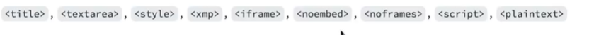

# Markdown

## Jump to

[Headings and Sub Headings](#headings-and-sub-headings) |

## Intro

Markdown is a lightweight markup language that is widely used for formatting plain text. It's file extension is .md

## Syntax & Flavours

While the basic syntax is consistent across implementations, there are some variations and extensions that different Markdown processors support. Here are a few notable variations:

1. **Standard Markdown (CommonMark)**
2. **GitHub Flavored Markdown (GFM)**
3. **Markdown Extra**
4. **Pandoc Markdown**
5. **MultiMarkdown (MMD)**
6. **R Markdown**
7. **AsciiDoc**

This document is focused on both Standard Markdown and GFM.

### The Escape Character

```
\
```

#### Headings and Sub Headings

```markdown
# Headline Level I

"Also Headline Level 1
="
```

```markdown
## Headline Level II

"Also Headlin Level II
-"
```

```markdown
### Headline Level III

#### Headline Level IV

##### Headline Level V

###### Headline Level VI
```

#### Special Styles

```markdown
**bold**
_italic_
```

also:

\_\_bold\_\_

\*italic\*

Block quote or quotation

```markdown
> Quotation
```

#### Divides

## Horizontal line:

```markdown
--- Horizontal Rule
\*\*\* Asterisks
\_\_\_ Underscores
```

#### Lists

```markdown
- Hyphens

* Asterisks

\+ Plus sign
```

```markdown
1. Number
1. Doesn't auto-increments

- this is indented under
```

#### Links

#### Images

Very similar to Links but use !

#### Code

\```lang?

\<insert code here\>

\```

## Github Markdown

#### Strike-through

```markdown
~~strike through~~
```

~~strike through~~

## Footnotes

This is a footnote [^1].

## Tables

| Left | Centre | Right |
| :--: | :----: | :---: |
| One  |  Two   | Three |

---- = Left Align

:--: = Centre

----: = Right Align

Doesnt really matter if pipes are aligned although common practice to do that

## Slash command

/ helps prompt and auto fill useful things, only works when in issues/ pull requests

only works

## Task List

-[ ] First

-[x] Completed

## Collapsed Details

<details>This is the collapsed details</details>

## Extending Syntax With HTML

## Alert Syntax

[!NOTE]

[!IMPORTANT]

[!WARNING]

Only works in pull requests

## Mermaid Graphs

## Disallowed Raw HTML



## Links to Great Guides/ Sites/ Articles

The CommonMark project - https://commonmark.org/

matt cone
website -
github - https://github.com/mattcone/markdown-guide

[^1]: My Reference
