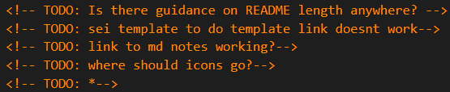

# README Notes
<!-- TODO: Is there guidance on README length anywhere? -->
<!-- TODO: sei template to do template link doesnt work-->
<!-- TODO: link to md notes working?-->
<!-- TODO: where should icons go?-->
<!-- TODO: *-->
<!-- TODO: *-->
<!-- TODO: *-->
<!-- TODO: *-->
<!-- TODO: *-->
<!-- TODO: Spellcheck-->
This document explains the purpose and contents of project/ personal README documents to be included in Github Project Repos.

## Contents
[Introduction](#introduction) |
[What's in a README](#what-is-in-a-readme)|
[Typical Structures](#typical-structures)|
[Markdown](#markdown)|
[Helpful Elements](#helpful-elements)
[Location](#location)|
[How to approach](#how-to-approach)|
[What and How much to write](#what-and-how-much-to-write)|
[Tips & Tricks](#tips-tricks)|
[Personal READMEs](#personal-readmes)|
[Examples](#examples)|
[Links](#links)|

## Introduction
A README file communicates important information about you or a project and is often the first item a visitor will see when visiting your profile or repository. 

It is important to give thought to its structure, content, and length to showcase what you are and your project is about.

Who is going to read it? Both you and others. Consider yourself as a different person months from now, you have forgotten some/most/all of the codebase but need to revisit a project - the README can help refresh your memory. Other people might be interested in the project or YOU; they may want to work with you or hire you. Knowing who will read this should help set the tone for an appropriate standard of README deliverable.

## What is in a README?
In a project repo, it typically includes information on:

- What the project does.
- Why the project is useful.
- How users can get started with the project.
- How users can test the project.
- Where users can get help with your project.
- Who maintains and contributes to the project.

During aquiring and building of skills in a developer's/ engineer's initial projects, it may be useful to include information to support/ showcase their learning:
- Challenges.
- Key wins.
- Brief and timescale.
- Was it solo or colab.
- Technologies used.
- Development methods.
- Future improvements.

READMEs can also communicate expectations and help manage contributions along side files/ info like:
- Licence.
- Citation file.
- Contribution guidelines.
- Code of conduct.

## Typical Structures

The structure should depend on the project, that said they may contain certain headings. The below can be deleted or expanded on as required.

### Learning Version
- Friendly title from project name
- Logo
- Description - try to keep to 1 sentance
- Contents
- Overview
- Infographic / How it works
- "Try here" (if deployed somewhere)
- Background
- Recreation
    - Pre-requisits
    - Links to other parts (if in seperate repos)
    - Deployment Link
    - Instructions
- Testing
- Brief
    - Functional Requirements
    - Non-Functional Requirements
    - Deliverables
    - Timescale
- Technologies Used
- Approach
  - Response to brief
  - Planning
  - General approach, project management, agile, sprints
  - Build/ Code Process
  - Debugging/ testing
- Result
    - Demo of componants
    - Finished code
- Wins
- Challenges / Blockers
- Bugs
- Future Content & Improvements
- Key Learnings
- Supporting Info

### ?
- Friendly title from project name
- Logo
- Description - try to keep to 1 sentance
- Contents
- Overview
- Infographic / How it works
- Implementation

## Markdown
Brief info about markdown, 

Refer to notes on markdown [HERE](#https://github.com/nedd-ludd/reference-github/blob/main/markdown/markdowns.md)

## Helpful Elements
Friendly title 
images, screenshots, GIFs

Code Snippets

## Location
If you put your README file in your repository's hidden .github, root, or docs directory, GitHub will recognize and automatically surface your README to repository visitors.
If a repository contains more than one README file, then the file shown is chosen from locations in the following order: the .github directory, then the repository's root directory, and finally the docs directory.

What goes in it
Where does it live?

## How to approach
- As coding progresses, if keeping notes as the project lifecycle develops, this can contain vital information for the readme later.
- Start with rough ideas, one word points, notes and bullet points.
- Can use commenting which does not show in "preview mode" of .md:

- Color things if needed for example - 
<span style="color:red">TODO - Formatting</span>
is acheived with:
```
<span style="color:red">TODO - Formatting</span>
```
- Remember to commit changes & push as required just like with codebase.

## What and How much to write
Collapseable/ - Although difficult to manage if too many, think about putting links in key places.
Consider using a Wiki

## Tips Tricks

- Write in clear concise language.
- If there is any information that is salient, unusual or interesting, put this first to save time when reading.
- Cosider tldr information at the top.
- Consider putting contact information first and saying you welcome messages. We are a community and communication is important.


## Personal READMEs
Here are some examples of my READMEs:

- [Whanpia](#https://github.com/nedd-ludd/whanpia-alerts/blob/main/README.md)
- [Calibre Library Hardcopies](#https://github.com/nedd-ludd/whanpia-alerts/blob/main/README.md)


## EXAMPLES
Here are below links to READMEs that I consider good/exemplar for different reasons:

### Student READMEs
- [ainokyto](#https://github.com/ainokyto/)
- [purvitrivedi](#https://github.com/purvitrivedi)
- [andy8radshaw](#https://github.com/andy8radshaw)

### GA SEI68 (my cohort)
-
-
-

### Professional
- 
- See Matiassingers awesome READMEs list below.

## Links

- [GitHub Docs | Repositories | About READMEs](https://docs.github.com/en/repositories/managing-your-repositorys-settings-and-features/customizing-your-repository/about-readmes)
- [GitHub Docs | Profiles | Your profile README](#https://docs.github.com/en/account-and-profile/setting-up-and-managing-your-github-profile/customizing-your-profile/managing-your-profile-readme)
- [My Markdown notes](../markdown/markdowns.md)
- [Matiassingers awesome READMEs](https://github.com/matiassingers/awesome-readme)
- [SEI68 template](./sei-template.odt)
- [freecodecamp article](#https://www.freecodecamp.org/news/how-to-write-a-good-readme-file)
- [bulldogjob article](#https://www.freecodecamp.org/news/how-to-write-a-good-readme-file/)